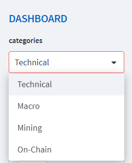

# Welcome to the *Bitcoin's Price Rabbit hole!* ₿

#### What if you could analyse Bitcoin's price influencers in one place ? 🔥

## Bitcoin's price influencers ⬇️
Bitcoin's price is mostly influenced by the following factors:   
- Psychological factors: technical analytics reflects it
- Macro-economical factors: Quantitive easing or tightning influences   
- Maining factors: are the incentivise to secure the network increasing or decreasing ?   
- On-Chain activity: how much is the Bitcoin's network being used?      

#### Those are the four categories of indicators available: 

## Types of Visualizations Available 📊

- Standard candlestic view   
    - with possibilities of logarithmic or linear both for BTC's price and indicator.
    - smooth the indicator's line with a moving average 
 

- Z-score visualization is a standard deviation visualization of the metric. Very helpful to visualize the tendencies.   

## Evaluation of Tendencies 📈

- For each indicator, you can click on "evaluate the current situation" and a tendency analysis will appear.   
    - This is only a personal insight and can't be trusted for any financial decision.   

- For each indicator or Bitcoin's price only, you can visualize what the machine learning can predict for the coming days or weeks.  
    - The model is based on Prophet.
    - The model is going to use the past prices and add a regressor based on the potential indicator.  
    - This is experimental and can't be trusted for any financial decision.  

### Connect with me 🫡  
[twitter] (https://twitter.com/AxelCryptoytb)
[linkedin] (https://www.linkedin.com/in/axel-girou-garcia/)
